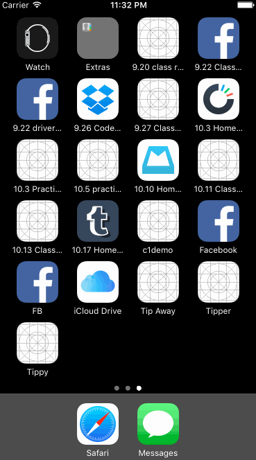

# 10.17-Homework---Tumblr-v.1
## Tumblr

The purpose of this homework is to leverage animations and gestures to create custom navigation. We're going to use the techniques from this week to implement some interactions in Tumblr.

Time spent: `<8>`

### Features

#### Required

- [x] Tapping on Home, Search, Account, or Trending should show the respective screen and highlight the tab bar button.
- [x] Compose button should modally present the compose screen.

#### Optional

- [ ] Compose screen is faded in while the buttons animate in.
- [ ] Login button should show animate the login form over the view controller.
- [ ] Discover bubble should bob up and down unless the SearchViewController is tapped.

#### The following **additional** features are implemented:

- [ ] List anything else that you can get done to improve the app functionality!

Please list two areas of the assignment you'd like to **discuss further with your peers** during the next class (examples include better ways to implement something, how to extend your app in certain ways, etc):

1. It seems there were a few different ways to animate the compose buttons - looping, for example - so I'd just be curious to see the variations in everyone's code. How many different ways are there to complete these same instructions?
2. Quan helped B and I set the initial positions of the compose buttons below the screen, but the code doesn't indicate specifically WHERE offscreen they were. This code below was used in the "viewWillAppear" method, but I don't understand how it indicates their position:

override func viewWillAppear(_ animated: Bool) {
        for i in buttons {
            i.center.y = view.frame.size.height
            i.alpha = 0

### Video Walkthrough 

Here's a walkthrough of implemented user stories:

GIF created with [LiceCap](http://www.cockos.com/licecap/).

## Notes

Describe any challenges encountered while building the app.

* Any libraries or borrowed content.
